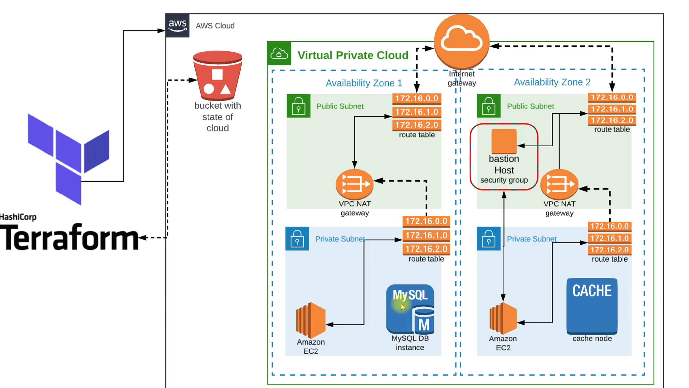
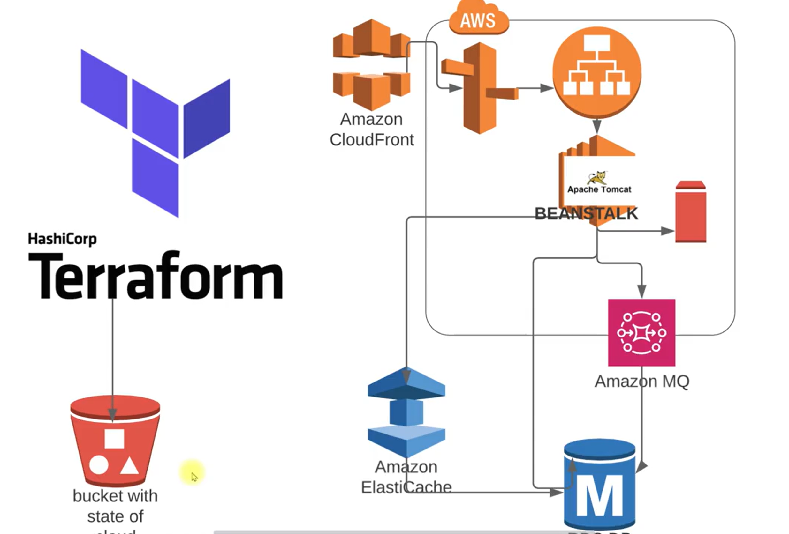

## This is a Terraform project for the deployment of a Java project - vprofile 

    - This project provisions the VPC network using aws modules 
    - Deploys the application itself to the provisioned network stack 
    - Uses AWS resources as PAAS and SAAS for provisioning rabbitmq, MySQL and Membcache services. (AWS Active mq, AWS RDS and Elastic cache)

## Project Architecture 



## Service Architecture 



## Create the terraform files needed to provision the infrastructure 
    - provider.tf, vars.tf, vpc.tf, securitygroups.tf, s3bucket.tf, keypairs.tf, .......
    - Implemented a VPC module, using the AWS module for vpc creation. This provisions 3 private subnets and 3 public subnets 
    - A NAT gateway, with dns support enabled in the VPC. 
    - The resources would be distributed accross 3 AZs for high availability 
    - Run below command to verify the plan and initialize your project 

        ```bash
        cd terraform-infra
        terraform init
        terraform fmt
        terraform validate
        terraform plan 
        terraform apply --auto-approve
        ```
## Update the project application files in the repository with the backend services public ip

    - Update the src/main/resources/application.properties with the endpoint for Active mq, rds and elastic cache services
    - Also update the corresponding users and passwords configured for the back end services
    - Build your artifacts for deployment using the below shell command 
    
        ```bash
        mvn install
        ```

## Upload artifacts to beanstalk service and access the application. 

    - Upload the vprofile-v2.war artifact to AWS Bealstalk for your use. 

## Set up remote state backend file for state management of infra

    - Create the backend state file. I have called mine backend-s3.tf 
    - Update it with the right key of s3 bucket to be used 
            ```bash
            terraform {
                backend "s3" {
                bucket = "terraformstate-vprofile"
                key    = "terraform/backend"
                region = "us-east-2"
                # dynamodb_table = "terraform-lock-table"
                encrypt = false
                }
            }
            ```
    - Reinitialize your repository so Terraform can pick up the change, follow the instructions to copy backend state to remote location

        ```bash
        terraform init -migrate-state               | Would migrate the backend file from remote to local. You should see a terraform.tfstate now. 
        terraform init -reconfigure
        ```
    - To revert back to local, just delete the content of the backend statefile and reinitialize the repository. 

!!! Enjoy thats all for today. 